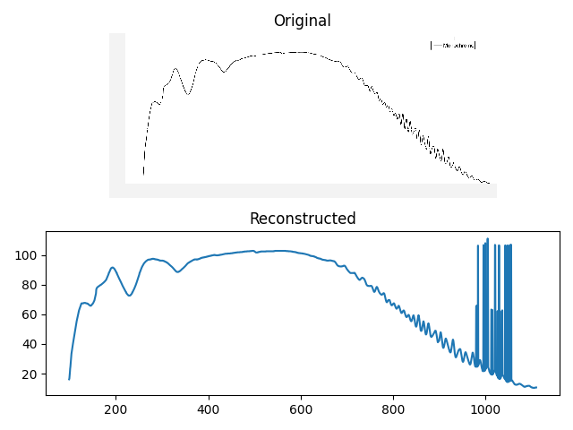

 [](https://badge.fury.io/py/plotdigitizer) [](https://zenodo.org/badge/latestdoi/140683649)

A Python3 command line utility to digitize plots

This utility is useful when you have a lot of similar plots that needs to be
digitized such as EEG, ECG recordings. See examples below.

Feel free to contact me for commercial work that may require optimizing this
pipeline for your use case. Please send a sample plot.

For occasional use, have a look at
[WebPlotDigitizer](https://automeris.io/WebPlotDigitizer/) by Ankit Rohatagi.

## Installation

```
$ python3 -m pip install plotdigitizer
$ plotdigitizer --help
```

## Preparing image

Crop the image and leave only axis and trajectories. I use
`gthumb` utility on Linux. You can also use imagemagick or gimp.

Following image is from MacFadden and Koshland, PNAS 1990 after trimming. One
can also remove top and right axis.


__Run__

```bash
plotdigitizer ./figures/trimmed.png -p 0,0 -p 10,0 -p 0,1
```

We need at least three points (`-p` option) to map axes onto the image.  In the example
above, these are `0,0` (where x-axis and y-axis intesect) , `20,0` (a point on
x-axis) and `0,1` (a point on y-axis). To map these points on the image, you
will be asked to click on these points on the image. _Make sure to click in
the same order and click on the points as precisely as you could. Any error in
this step will propagate._ If you don't have `0,0` in your image, you have to provide
4 points: 2 on x-axis and 2 on y-axis.

The data-points will be dumped to a csv file specified by __`--output
/path/to/file.csv`__.

If `--plot output.png` is passed, a plot of the extracted data-points will be
saved to `output.png`. This requires `matplotlib`. Very useful when debugging/testing.


Notice the error near the right y-axis.

## Using in batch mode

You can pass the coordinates of points in the image at the command prompt.
This allows to run in the batch mode without any need for the user to click on
the image.

```bash
plotdigitizer ./figures/trimmed.png -p 0,0 -p 20,0 -p 0,1 -l 22,295 -l 142,295 -l 22,215 --plot output.png
```

### How to find coordinates of axes points

In the example above, point `0,0` is mapped to coordinate `22,295` i.e., the
data point `0,0` is on the 22nd row and 295th column of the image (_assuming that bottom left
of the image is first row, first column `(0,0)`_). I have included an utility
`plotdigitizer-locate` (script `plotdigitizer/locate.py`) which you can use to
find the coordinates of points.


```bash
$ plotdigitizer-locate figures/trimmed.png
```

or, from the source,

```bash
$ python3 plotdigitizer/locate.py figures/trimmed.png
```

This command opens the image in a simple window. You can click on a point and
its coordinate will be written on the image itself. Note them down.


# Examples


### Base examples

```bash
plotdigitizer figures/graphs_1.png \
		-p 1,0 -p 6,0 -p 0,3 \
		-l 165,160 -l 599,160 -l 85,60 \
		--plot figures/graphs_1.result.png \
		--preprocess
```


### Light grids

```
plotdigitizer  figures/ECGImage.png \
		-p 1,0 -p 5,0 -p 0,1 \
        -l 290,337 -l 1306,338 -l 106,83 \
		--plot figures/ECGImage.result.png
```


### With grids

```
plotdigitizer  figures/graph_with_grid.png \
		-p 1,0 -p 5,0 -p 0,1 \
        -l 81,69 -l 1779,68 -l 81,449 \
		--plot figures/graph_with_grid.result.png
```




# Limitations

Currently this script has following limitations:

- Background must not be transparent. It might work with transparent background but
  I've not tested it.
- Only b/w images are supported for now. Color images will be converted to grayscale upon reading.
- One image should have only one trajectory.

## Need help

Open an issue and please attach the sample plot.

## Related projects by others

1.  [WebPlotDigitizer](https://automeris.io/WebPlotDigitizer/) by Ankit
Rohatagi is very versatile.


## Notes

- grapvhiz version 2.47.2 is broken for some xml files. See
<https://forum.graphviz.org/t/assert-sz-2-in-convertsptoroute/689>. Please use a
different version.
